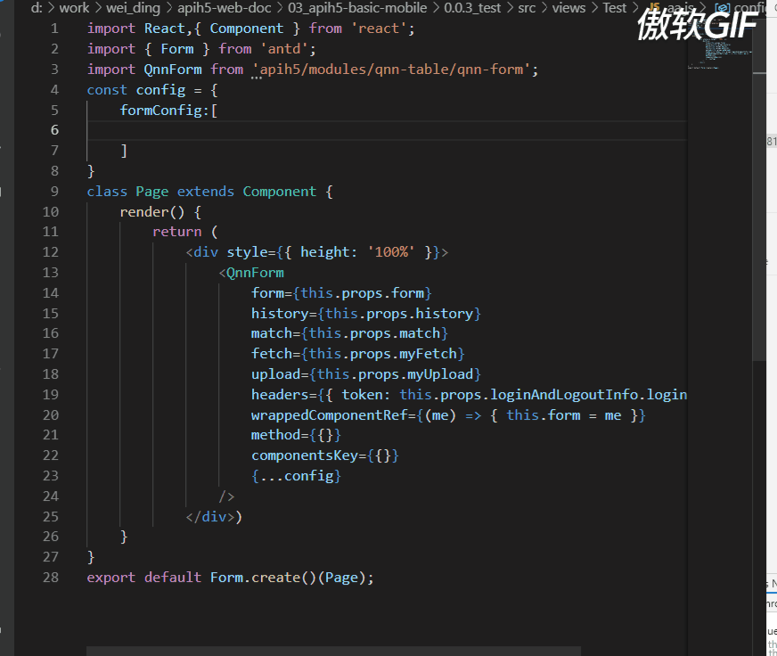
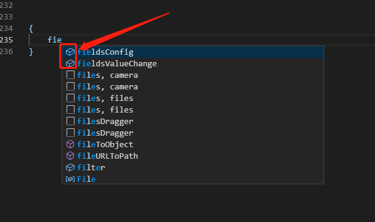
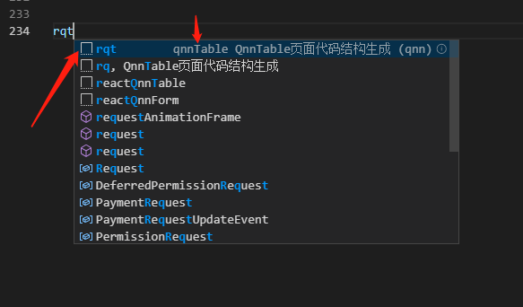
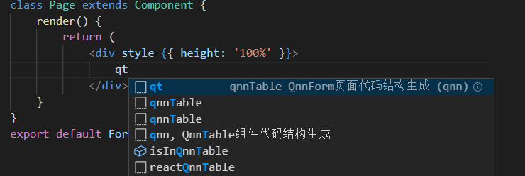
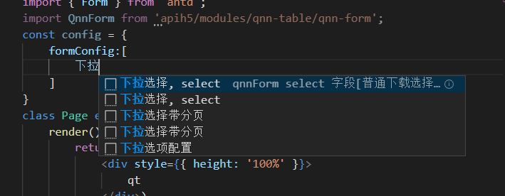

### qnn 组件·vsCode 插件

###### 提供 qnn-form、qnn-table 组件配置 api 属性智能提示、代码段自动补全等。

<a href="https://marketplace.visualstudio.com/items?itemName=xm.qnn">☞ 插件主页</a>
<a href="./CHANGELOG.md">☞ 升级日志</a>

<b>支持以下功能</b>

-   配置属性提示
-   代码段自动补全

#### 先睹为快

对于不记得的单词可使用中文

###### ps: 代码段标识 属性标识 以及 qnn-form 和 qnn-table 组件的代码段区分

-   属性提示：如下图 ↓，注意左侧图标形状，键盘上下键选择后直接回车即可
    

*   代码段补全：如下图 ↓，注意左侧图标形状，键盘上下键选择后直接回车即可自动补全
    需注意的是代码段为 qnnTable 还是 qnnForm 的代码段的区分点是第二个箭头处提示的。
    

<b>使用文档</b>

-   代码段生成

    -   <a>qnnTable、qnnForm 组件代码段生成</a>

        -   qnnTable 组件代码段生成 关键词[qt、qnn、qnnTable]
            效果图：
            

        -   qnnForm 组件代码段生成 关键词[qf、qnn、qnnForm]
            效果图：和table一样效果，只是代码段不同

    - <a>qnnTable、qnnForm页面代码生成</a>
        - qnnTable组件代码段生成 关键词[rq、rqf、reactQnnForm]
        效果图： 
            

        - qnnForm组件代码段生成 关键词[rq、rqf、reactQnnForm]
        效果图：和table一样效果，只是代码段不同

    - <a>qnnTable、qnnForm 字段生成</a>
        - 需要什么字段就写什么字段的引文名字或者中文
        如：字符串可以直接拼写 "字符串" 或者 "string" 都会出现提示
        效果图： 
        各类下拉
        

    - <a>其他</a>
        基本遵循上面的规范都是基于插件readme文档操作 

    -  eg
        * rqf 
        * rqt
        * qt
        * qf
        * 身份证
        * 人民币
        * 密码
        * 电话
        * 座机
        * 整数
        * 邮箱
        * 网址
        * 富文本
        * 年
        * 年月日
        * 日期
        * 时间
        * 月
        * 时间区域选择
        * 自定义组件
        * 下拉选择
        * 下拉选择带分页
        * 层叠联动
        * 联动
        * oa拉人
        * 拉人
        * 树节点
        * 多行文本
        * 文件上传
        * 文件拖动上传
        * 文件上传移动端
        * 问题答案选项
        * 单选
        * 多选
        * 开关
        * 打分
        * 滑块
        * 无限联动
        * 表单块
        * 表格
        * 字段布局
        * 布局
        * 按钮布局
        * 搜索框布局
        * ajax请求
        * 按钮
        * 按钮条件显隐配置
        * 条件显隐
        * 自定义效验规则
        * 效验规则
        * 下拉选项配置
        * 双向绑定
        * 联动
        * 删除按钮
        * 自定义页面按钮
        * 新增行按钮
        * 新增按钮
        * 操作按钮
        * 移动端列表项布局 

        以上都可以使用英文单词
        ....
